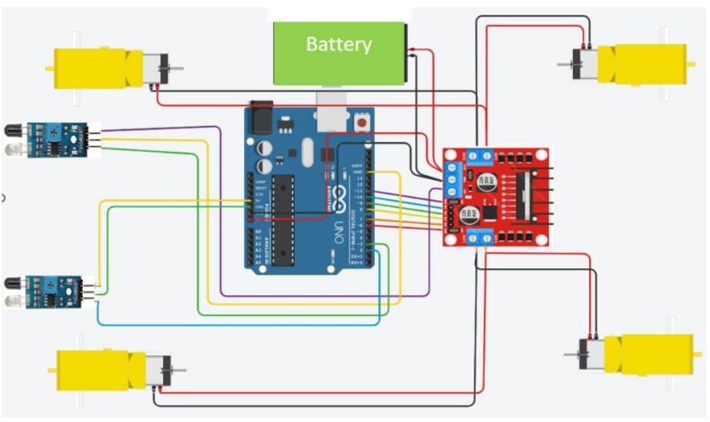
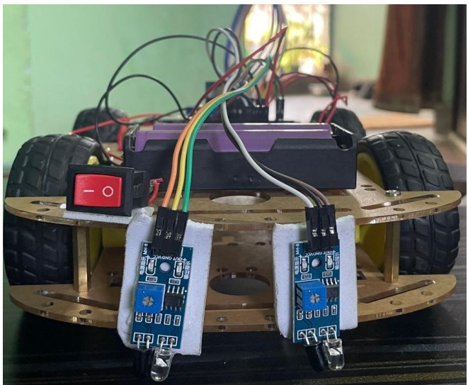

# 🤖 Line Follower Robot using Arduino

A smart line-following robot built with **Arduino UNO**, **IR sensors**, and an **L298N motor driver**. It autonomously follows a black line on a white surface using sensor feedback and motor control logic.

---

## 📌 Description

🔍 This robot detects and follows a black line using IR sensors and adjusts its direction with motor drivers. It's a basic but essential project in embedded systems and robotics for learning automation and control.

---

## 🧠 How It Works

- 👀 **IR sensors** detect black vs white surfaces.
- 🧠 **Arduino UNO** processes sensor inputs.
- ⚙️ **Motor Driver (L298N)** drives the motors based on logic.
- 🔋 A **battery pack** powers the entire system.

---

## 🔌 Circuit Diagram

Schematic showing how everything is connected:

---

## 🤖 Robot Snapshots

Here's what the final working robot looks like:

| Front View | Side View |
|------------|-----------|
|  |  |

---

## 📽️ Robot in Action – Demo

> 🎥 Full video also available as [demo.mp4](images/demo.mp4)
---

## ⚙️ Components Used

| 🔩 Component         | 🔢 Quantity |
|---------------------|-------------|
| Arduino UNO         | 1           |
| IR Sensor Module    | 2–5         |
| L298N Motor Driver  | 1           |
| DC Motors           | 2           |
| Robot Chassis       | 1           |
| Wheels              | 2           |
| Battery (9V/12V)    | 1           |
| Jumper Wires        | As needed   |

---

## 🛠️ Getting Started

### 📥 Uploading the Code

1. Open `line_follower.ino` in **Arduino IDE**
2. Connect your Arduino via USB
3. Select the correct **Board** and **Port**
4. Click ✅ **Upload**
5. Power your robot and place it on a line

---
## 📁 Project Structure
line-follow-robot/
├── line_follower.ino
├── components.md
├── images/
│ ├── demo.gif
│ ├── demo.mp4
│ ├── robot-snapshot1.jpg
│ ├── robot-snapshot2.jpg
│ └── circuit-diagram.jpg

---